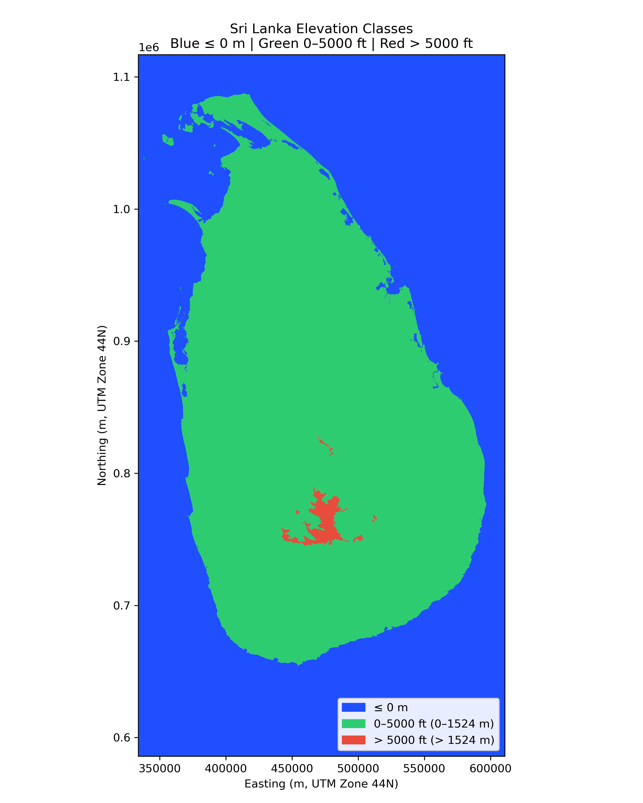

# Sri Lanka 5000 ft Elevation Analysis (DEM-) by යසස් පොන්වීර

This repository contains a fully reproducible Digital Elevation Model (DEM) analysis to quantify the land area of Sri Lanka above 5000 ft (1524 m) Mean Sea Level using Copernicus 30 m resolution elevation data.

All computations are raster-based, projected into UTM Zone 44N, and validated against the official land area of Sri Lanka.

---

## Final Result

Using Copernicus 30 m DEM and pixel-area integration:

- Area above 5000 ft (1524 m): **751.34 km²**
- Percentage of Sri Lanka’s land area (65,610 km²): **1.145 %**
- Estimated numerical uncertainty: **±0.5 % (~±4 km²)**

This high-elevation zone corresponds mainly to:
- Horton Plains
- Pidurutalagala massif
- Knuckles core
- Upper Peak Wilderness

---

## Validation of Method (Land Area Sanity Check)

A strict land-only verification (DEM elevation > 0 m, Sri Lanka polygon masked) produced:

- DEM land area: **65,325.94 km²**
- Official land area: **65,610 km²**
- Difference: **–284.06 km² (–0.433 %)**

This confirms:
- Correct reprojection
- Correct pixel-area integration
- Correct land/ocean discrimination
- End-to-end numerical error < **0.5 %**

Therefore, the 5000-ft area result is fully validated.

---

## Elevation Classification Map (3-Class)

A 3-class 2D elevation map has been generated:

- Blue → elevation ≤ 0 m  
- Green → 0–5000 ft (0–1524 m)  
- Red → >5000 ft (>1524 m)  

Rendered map:



This map clearly delineates Sri Lanka’s central highlands from lowland plains and the surrounding ocean.

---

## Repository Structure

```
DEM-/
├── scripts/
│   ├── area_above_5000ft.py
│   ├── check_total_area.py
│   ├── check_land_area_masked.py
│   ├── check_land_area_masked_strict.py
│   └── plot_3class_2d.py
│
├── results/
│   └── area_above_5000ft.txt
│
├── figs/
│   └── srilanka_3class_0_5000ft.png
│
└── data/
    └── dem/
        └── srilanka_dem.tif   (not included)
```

---

## DEM Data

The DEM file:

```
data/dem/srilanka_dem.tif
```

is not stored in this repository because it is ~300 MB.

To reproduce the analysis, obtain any 30 m DEM covering Sri Lanka, such as:

- Copernicus GLO-30
- SRTM 1 arc-second

Then:

1. Clip or mosaic to Sri Lanka extent
2. Save as:

```
data/dem/srilanka_dem.tif
```

The analysis script will automatically reproject it to UTM Zone 44N.

---

## Reproduction Steps (Debian / Ubuntu)

```bash
sudo apt-get update
sudo apt-get install -y gdal-bin python3-rasterio python3-numpy python3-geopandas python3-matplotlib

python3 scripts/area_above_5000ft.py
```

Expected output:

```
Area above 5000 ft: 751.34 km²
Percent of Sri Lanka: 1.145 %
```

---

## Scientific Notes

- Area integration is performed using true UTM pixel area.
- Coastline uncertainty dominates low-elevation error but does not affect high-elevation (>1524 m) zones.
- The DEM reproduces national land area within 0.43 %, confirming geometric reliability.

---

## License

This repository contains open analytical scripts and no proprietary elevation data.

You are free to reuse the scripts, reproduce the calculations, and extend the analysis to other elevation thresholds.

---

## Citation

If you use these results, please cite as:

Sri Lanka 5000 ft Elevation Analysis, Copernicus 30 m DEM, raster-based UTM integration, 2025.